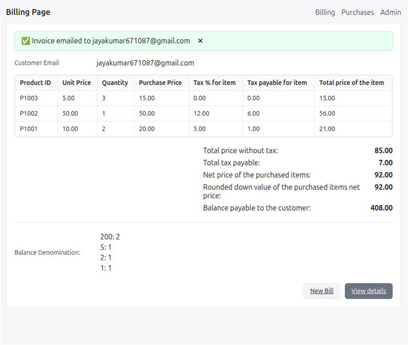

# Billing_System

A web-based billing and inventory management system built with FastAPI, SQLAlchemy, and Jinja2.
It supports:

Customer management

Product tracking

Purchase history

Automatic email notifications with invoice generation

Change denomination calculation

Drill-down analytics by customer and product

Tech Stack: FastAPI · SQLite · Jinja2 · SQLAlchemy

## ✨ Features

- **Billing workflow**
  - Add multiple items by Product ID, quantity
  - Auto‑compute subtotal, tax, net total
  - Accept cash paid; compute **balance** and **denomination breakdown**
  - Show final bill summary page with all line items
- **Email notifications**
  - Sends invoice email to the customer on bill generation  
  - Success/error banner shown on the bill page
- **Purchases dashboard**
  - Totals: revenue, purchases, **unique customers** (normalized by trim/lower)
  - Click a customer in the table to filter purchases by that customer
  - “Unique customers” count links to a **Customers** page
- **Customers view**
  - List of unique customers with order counts
  - Click a customer to see all purchases and total revenue from that customer
- **Products view**
  - List of unique products with order counts & total quantity sold
  - Click a product to see all purchases containing that product
- **Admin – Products**
  - CRUD: create/update products (name, stock, unit price, tax%)
  - Update stock and prices via a simple UI

## 📸 Screenshots

### 1. Billing Page


### 2. Generate Bill & Email Sent Notification


### 3. Purchase Details by Customer


### 4. All Products Details


## 🗂️ Project Structure

```
.
├── app.py
├── billing.db
├── database.py
├── mail_notification.py
├── models.py
├── README.md
├── requirements.txt
├── schemas.py
├── static/
│   └── styles.css
└── templates/
    ├── admin_product_form.html
    ├── admin_products.html
    ├── base.html
    ├── bill_display.html
    ├── billing_form.html
    ├── customers.html
    ├── products.html
    ├── purchase_detail.html
    └── purchases.html
```

## 🧰 Tech Stack

- **FastAPI** (app, routing)
- **Jinja2** (server‑rendered templates)
- **SQLAlchemy** (ORM)
- **SQLite** (`billing.db`)
- **Uvicorn** (ASGI server)
- **Python 3.9+** (uses `Optional[...]` types for 3.9 compatibility)

## 🚀 Quick Start

```bash
# 1) Create & activate a venv (Python 3.9+)

# --- On macOS/Linux ---
python3 -m venv poc-env
source poc-env/bin/activate

# --- On Windows (Command Prompt) ---
python -m venv poc-env
.poc-env\Scripts\activate

# 2) Install dependencies

# --- On macOS/Linux ---
pip3 install -r requirements.txt

# --- On Windows ---
pip install -r requirements.txt


# 3) Initialize DB (first run creates tables)
#   If your models call Base.metadata.create_all(...) on import, just run the app.
#   Otherwise, add a small init step in app.py/database.py.

# 4) Start the server
# Default (localhost)
# uvicorn app:app --reload

# Bind to all interfaces (useful for LAN access)
uvicorn app:app --reload --host 0.0.0.0 --port 8000


# 5) Open in browser
# Billing form:        http://127.0.0.1:8000/billing
# Purchases dashboard: http://127.0.0.1:8000/purchases
# Customers view:      http://127.0.0.1:8000/customers
# Products view:       http://127.0.0.1:8000/products
# Admin (products):    http://127.0.0.1:8000/admin/products
```

## ✉️ Email Setup

Edit `mail_notification.py` (or your mailer) with your SMTP credentials. Example:

```python
# mail_notification.py (example)
SMTP_HOST = "smtp.gmail.com"
SMTP_PORT = 465
SMTP_USER = "your_email@gmail.com"
SMTP_PASS = "your_app_password"  # use an App Password if using Gmail

def send_invoice_email(to_email: str, purchase_id: int):
    # build body / attach PDF if you have it
    # use smtplib to send
    ...
```

> **Gmail note:** Use an **App Password** (2FA required). Standard passwords usually fail.

The bill page (`bill_display.html`) shows a notification based on values passed from `/generate_bill`:
- `email_notice`: e.g., “Invoice emailed to …” or error message
- `email_status`: `"success"` or `"error"`

## 🧮 Billing Flow (What Happens)

1. User fills **Billing** form (`/billing`) with customer email, product IDs, and quantities.  
2. Server validates items, stock, and calculates:
   - Per‑item: purchase price, tax% for item, tax amount, total
   - Totals: subtotal (before tax), total tax, net total
   - Paid amount and **balance** (change to return)
   - **Denomination** breakdown for change
3. Persists `Purchase` and `PurchaseItem`s, decrements product stock.
4. Sends the invoice email.  
5. Renders **bill summary** page with a green/red banner based on email result.

## 🔎 Drill‑Down Views & Routes

- **`GET /purchases`**  
  Dashboard with totals and table of recent purchases.  
  Click a **customer** in the table to filter by that customer.
- **`GET /customers`** (`?customer=<email>` optional)  
  - Lists unique customers + order counts  
  - If `customer` is provided: show purchases for that customer and total revenue
- **`GET /products`** (`?product=<name>` optional)  
  - Lists unique products + order counts + total quantity  
  - If `product` is provided: show all purchases that contained that product, plus per‑product qty & revenue
- **`GET /purchase/{id}`**  
  Purchase detail page (line items for that purchase)
- **`GET /admin/products`**, **`/admin/products/new`**  
  Admin UI for managing products

## 🗃️ Data Model (simplified)

- **Product**: `id`, `product_id` (public ID), `name`, `available_stock`, `price_per_unit`, `tax_percentage`
- **Purchase**: `id`, `customer_email`, `total_amount`, `paid_amount`, `balance`, `purchase_time`, `items` (relationship)
- **PurchaseItem**: `id`, `purchase_id` → Purchase, `product_id` → Product, `quantity`  
  (You may also store `price_per_unit` and `tax_percentage` on item rows for historical pricing.)
- **Denomination**: `value` (e.g., 500, 50, 20, …)

## 🧹 Data Hygiene

- Unique customers are computed with **normalized emails** (`trim + lower`) to avoid duplicates from whitespace/case.  
- You can add a `@validates("customer_email")` hook to normalize on write.

## ⚠️ Common Pitfalls

- **Python 3.9 union types:** Use `from typing import Optional` and `Optional[str]` instead of `str | None`.
- **Products view 500 error:** Ensure `PurchaseItem` joins to `Product` and aggregate by `Product.name` (normalized).
- **Gmail SMTP:** Use App Passwords; standard credentials often fail.

## 📄 License

This project is licensed under the MIT License — you are free to use, modify, and distribute it for personal or commercial purposes, provided that the original copyright notice and this permission notice are included in all copies or substantial portions of the software.

This is an open-source project, accessible to everyone.
Contributions, bug fixes, and feature requests are always welcome!


## 👤 Author

[](https://github.com/jkshine111)  
[](https://www.linkedin.com/in/jayakumar-s-%F0%9F%87%AE%F0%9F%87%B3-4a6b461a4/)  
[](https://www.instagram.com/jayakumar20003)
